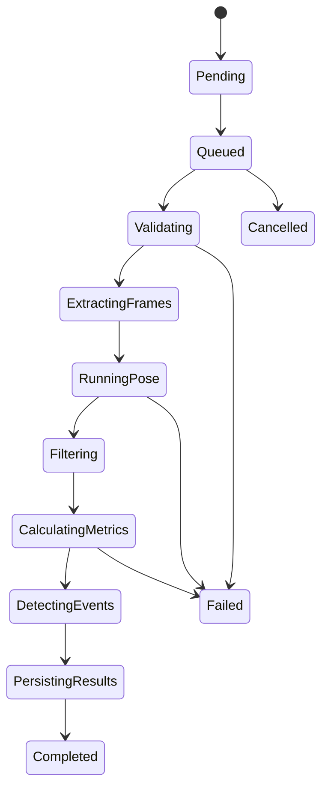

# Architecture

MotionForge uses a modular monorepo rather than unnecessary microservices. The API owns identity, tenancy, workflow state, metadata, reviews, and authorization. CPU-intensive analysis is delegated to a bounded worker. Dense pose frames are compressed into artifact storage; PostgreSQL holds queryable summaries and governance records.

## Processing flow

## Coordinate systems

- `image_pixel`: original decoded pixels.
- `image_normalized`: x and y normalized by image width/height.
- `camera_plane_3d`: normalized x/y with non-metric z; used honestly for monocular browser visualization.
- `world_3d`: calibrated triangulated coordinates and explicit units.

No service silently combines coordinate spaces.

## Tenant boundary

Every tenant-owned table carries `organization_id`. API queries include the active organization and require a corresponding membership. Object paths include organization and session identifiers but are never treated as authorization; the API checks the database membership before returning an artifact.
