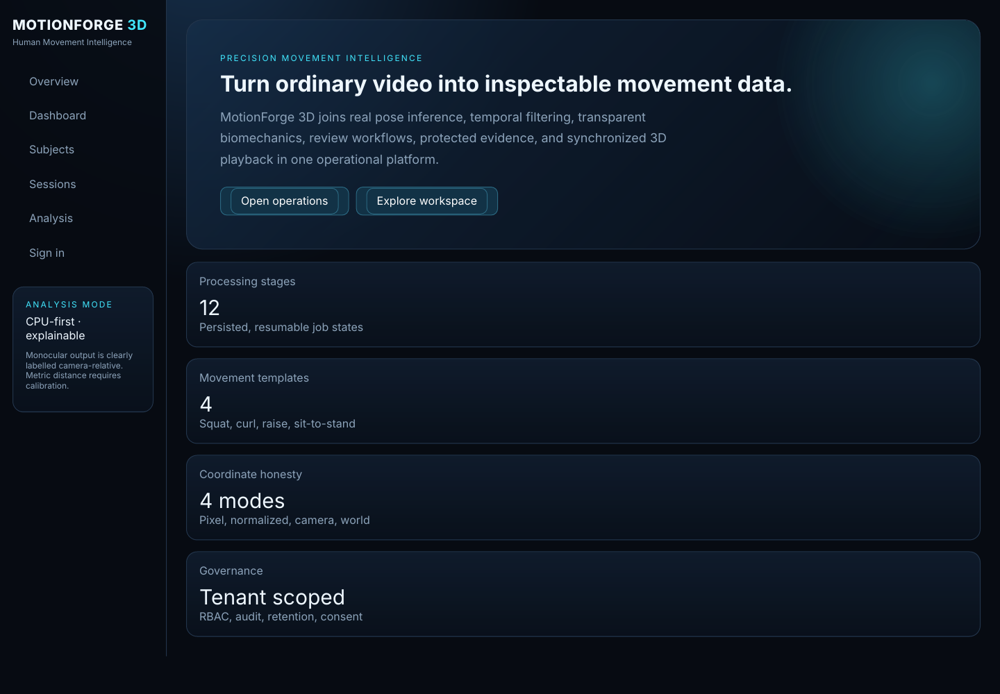
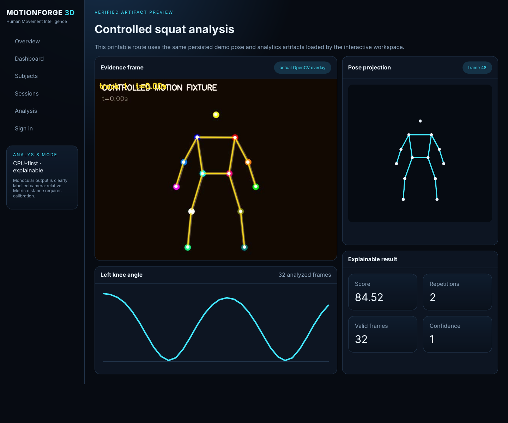
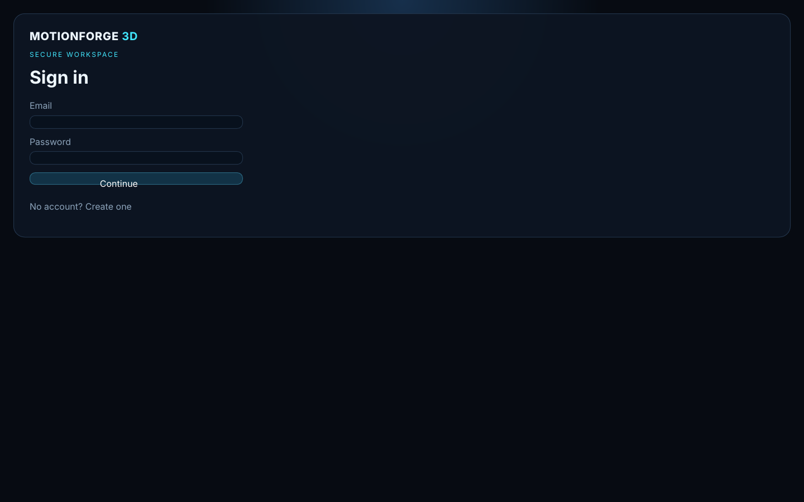
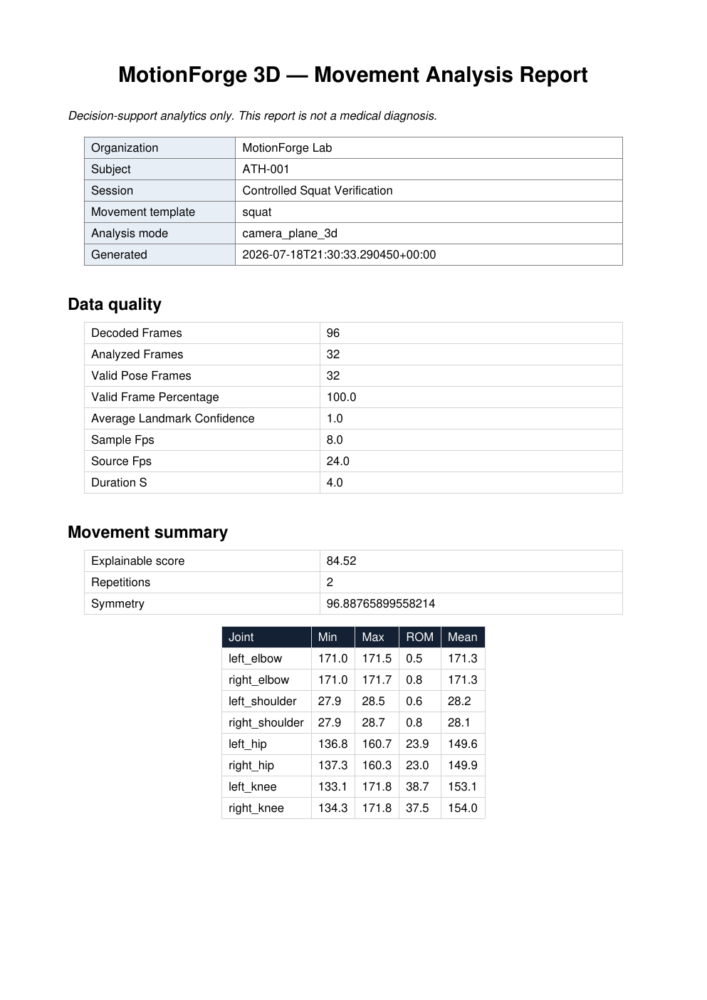
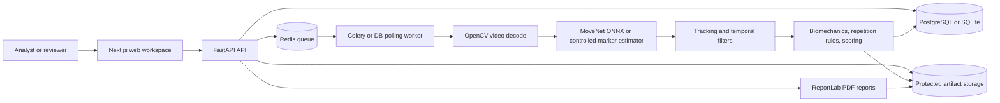

# MotionForge 3D

[](LICENSE)
[](https://github.com/HUSNAIN-MUNAWAR/motionforge-3d/actions/workflows/ci.yml)
[](pyproject.toml)
[](apps/api/motionforge/main.py)
[](apps/web/package.json)
[](docker-compose.yml)
[](CONTRIBUTING.md)

**MotionForge 3D** is a CPU-first human movement intelligence platform that turns video into pose sequences, biomechanics metrics, synchronized 3D review data, audit-ready workflows, and protected PDF reports.

> Decision-support analytics only. MotionForge 3D does not diagnose injuries or medical conditions. Monocular measurements are camera-relative unless a calibrated multi-view workflow is used.

## Why This Exists

Movement analysis software often hides too much of the pipeline: model confidence, frame coverage, coordinate assumptions, repetition logic, and report provenance. MotionForge 3D is built to make those decisions inspectable. It gives coaches, clinicians, researchers, and engineering teams a reproducible reference implementation for video ingestion, pose processing, deterministic movement analytics, review workflows, and report generation without requiring a GPU-first deployment.

## Features

- Multi-tenant FastAPI backend with registration, login, Argon2 password hashing, JWT access tokens, organization membership, tenant-scoped queries, RBAC helpers, and audit events.
- PostgreSQL-ready SQLAlchemy schema with Alembic migrations and SQLite support for local development and tests.
- Validated MP4/MOV ingestion with generated storage names, byte limits, decode checks, video metadata, hashes, duplicate detection, and duration limits.
- Persisted processing jobs with Celery/Redis support in Docker and a database-polling worker for lower-dependency local workflows.
- MoveNet ONNX pose-estimator adapter using OpenCV DNN plus a SHA-256-pinned model downloader.
- Deterministic OpenCV color-fiducial estimator for CI and sandbox verification. It performs real pixel segmentation and is not presented as a general human model.
- Pose tracking, One Euro and EMA filters, compressed pose artifacts, evidence overlays, coverage metrics, confidence metrics, and frame-level data export.
- Joint-angle geometry, timestamp-aware derivatives, ROM summaries, symmetry metrics, repetition detection, deterministic rules, and explainable scoring.
- Versioned movement templates for squat, bicep curl, shoulder raise, and sit-to-stand.
- Calibrated two-view triangulation utilities with projection, reconstruction, and reprojection-error tests.
- Next.js workspace with onboarding, dashboard, subjects, sessions, protected media loading, 3D pose playback, synchronized timeline controls, analytics cards, and printable preview routes.
- ReportLab PDF reports generated from persisted analysis records and served through protected tenant-authorized endpoints.
- Docker Compose stack for API, worker, web, PostgreSQL, Redis, MinIO, and optional Prometheus/Grafana monitoring.

## Screenshots

The screenshots below are checked into `docs/screenshots/` and are generated from the application and packaged demo artifacts. They use synthetic controlled-fixture data and do not contain secrets or private media.

| Overview | Controlled Analysis |
| --- | --- |
|  |  |

| Secure Workspace | PDF Report |
| --- | --- |
|  |  |

See [docs/screenshots/README.md](docs/screenshots/README.md) for screenshot provenance.

## Architecture



Dense frame-level pose data is stored as compressed artifacts. Summaries, jobs, review annotations, reports, audit events, and tenant indexes stay in the relational database.

## Technology Stack

- **Backend:** Python 3.12+, FastAPI, Pydantic, SQLAlchemy, Alembic, Uvicorn.
- **Analytics:** OpenCV, NumPy, SciPy, custom pose tracking/filtering, deterministic rules, calibrated geometry utilities.
- **Reports:** ReportLab PDF generation.
- **Async/infra:** Celery, Redis, PostgreSQL, MinIO, Docker Compose.
- **Frontend:** Next.js 14, React 18, TypeScript, React Three Fiber, Three.js, Recharts.
- **Quality:** Pytest, Ruff, MyPy, GitHub Actions, gitleaks, container builds.

## Quick Start

Backend local mode uses SQLite by default and does not require Docker.

```bash
git clone https://github.com/HUSNAIN-MUNAWAR/motionforge-3d.git
cd motionforge-3d
python -m pip install -e ".[dev,postgres,queue,storage]"
PYTHONPATH=.:apps/api alembic upgrade head
PYTHONPATH=.:apps/api python scripts/bootstrap/seed.py
PYTHONPATH=.:apps/api uvicorn motionforge.main:app --reload --port 8000
```

Open:

- API health: `http://localhost:8000/health`
- API readiness: `http://localhost:8000/ready`
- OpenAPI docs: `http://localhost:8000/api/docs`

Start the web app in a second terminal:

```bash
cd apps/web
npm install
npm run dev
```

Open `http://localhost:3000`.

On Windows, replace `python` with `py` and set `PYTHONPATH` with PowerShell:

```powershell
$env:PYTHONPATH = ".;apps/api"
py -m uvicorn motionforge.main:app --reload --port 8000
```

## Demo Data

Seeded records are synthetic and are intended for local evaluation only.

```bash
PYTHONPATH=.:apps/api python scripts/bootstrap/seed.py
```

Demo credentials after seeding:

- Owner: `demo@motionforge.local` / `MotionForgeDemo!2026`
- Reviewer: `reviewer@motionforge.local` / `MotionForgeReview!2026`

The measured verification workflow creates a controlled encoded MP4 fixture, decodes pixels, recovers landmarks with the marker estimator, filters pose data, computes metrics, detects repetitions, persists results, creates an evidence image, and generates a PDF report:

```bash
PYTHONPATH=.:apps/api python scripts/verification/verify_e2e.py
```

Machine-readable output is written to `docs/verification_results.json`.

## Docker Workflow

```bash
cp .env.example .env
# Replace placeholder secrets and local MinIO credentials before non-local use.
python scripts/models/download_movenet.py
docker compose up --build
PYTHONPATH=.:apps/api alembic upgrade head
PYTHONPATH=.:apps/api python scripts/bootstrap/seed.py
```

Services:

- Web: `http://localhost:3000`
- API: `http://localhost:8000`
- OpenAPI: `http://localhost:8000/api/docs`
- MinIO console: `http://localhost:9001`
- Optional monitoring: `docker compose --profile monitoring up`

## Configuration

Use `.env.example` as the source of expected settings. Do not commit `.env`.

| Variable | Purpose | Local default |
| --- | --- | --- |
| `MOTIONFORGE_ENVIRONMENT` | Runtime environment label | `development` |
| `MOTIONFORGE_SECRET_KEY` | JWT signing key; use at least 32 random bytes outside local dev | placeholder |
| `MOTIONFORGE_DATABASE_URL` | SQLAlchemy database URL | SQLite fallback in code, PostgreSQL in Docker example |
| `MOTIONFORGE_STORAGE_ROOT` | Local or mounted artifact root | `storage` |
| `MOTIONFORGE_MODEL_BACKEND` | `movenet` or controlled `marker` backend | `movenet` |
| `MOTIONFORGE_MODEL_PATH` | ONNX model path | `models/movenet-singlepose-lightning.onnx` |
| `MOTIONFORGE_SAMPLE_FPS` | Video sampling rate | `8` |
| `MOTIONFORGE_QUEUE_MODE` | `database` or `celery` | `database` locally, `celery` in Compose |
| `MOTIONFORGE_CELERY_BROKER_URL` | Redis broker URL | Compose Redis URL |
| `MOTIONFORGE_CELERY_RESULT_BACKEND` | Redis result backend URL | Compose Redis URL |
| `MOTIONFORGE_ALLOWED_ORIGINS` | CORS allow-list | `http://localhost:3000` |
| `NEXT_PUBLIC_API_URL` | Browser-facing API base URL | `http://localhost:8000` |

## API Workflow

```bash
curl -X POST http://localhost:8000/api/v1/auth/register \
  -H "Content-Type: application/json" \
  -d '{"email":"analyst@example.com","password":"verystrongpass1","display_name":"Demo Analyst"}'
```

Typical application flow:

1. Register or log in with `/api/v1/auth/register` or `/api/v1/auth/login`.
2. Create an organization with `/api/v1/organizations`.
3. Send `X-Organization-ID` for tenant-owned resources.
4. Create a subject with `/api/v1/subjects`.
5. Create a session with `/api/v1/sessions`.
6. Upload media with `/api/v1/sessions/{id}/media`.
7. Let Celery consume the job in Docker, run the database worker, or call `/api/v1/jobs/{job_id}/run` in local demo mode.
8. Read analysis from `/api/v1/analysis/{session_id}` and pose data from `/api/v1/analysis/{session_id}/pose`.
9. Add review annotations and generate a protected report.

## CLI and Scripts

MotionForge 3D does not expose a packaged end-user CLI yet. Operational scripts are available for repeatable local workflows:

```bash
PYTHONPATH=.:apps/api python scripts/bootstrap/seed.py
PYTHONPATH=.:apps/api python scripts/demo/generate_marker_video.py
PYTHONPATH=.:apps/api python scripts/verification/verify_e2e.py
python scripts/models/download_movenet.py
```

## Validation Commands

Backend:

```bash
python -m ruff check apps packages scripts tests
python -m ruff format --check apps packages scripts tests
python -m mypy apps packages
python -m pytest -q
PYTHONPATH=.:apps/api alembic upgrade head
PYTHONPATH=.:apps/api python scripts/verification/verify_e2e.py
```

Frontend:

```bash
cd apps/web
npm install
npm run typecheck
npm run build
```

Docker:

```bash
docker compose up --build
```

Only report these commands as passing when they have been run in the target environment. See [docs/VERIFICATION_REPORT.md](docs/VERIFICATION_REPORT.md) for the packaged controlled-workflow report.

## Project Structure

```text
apps/api/                 FastAPI application, routers, schemas, services
apps/worker/              Celery worker and database-polling worker
apps/web/                 Next.js analysis workspace
packages/pose_core/       Pose estimators, tracking, filtering, video pipeline
packages/motion_analytics Geometry, repetition detection, scoring, triangulation
configs/movements/        Versioned movement templates
scripts/bootstrap/        Demo seed workflow
scripts/demo/             Synthetic marker-video generation
scripts/models/           MoveNet ONNX downloader
scripts/verification/     Measured end-to-end verification workflow
alembic/                  Database migrations
docs/                     Architecture, algorithms, reports, runbooks, screenshots
infra/                    Monitoring and deployment support
tests/                    Unit and integration tests
```

## Security Notes

- Do not use the placeholder `.env.example` secrets outside local development.
- Keep private videos, local databases, model caches, `.env`, object-storage volumes, and generated credentials out of Git.
- Tenant isolation, audit events, protected artifact endpoints, generated filenames, media validation, and JWT-based access are implemented.
- Refresh-token rotation, SSO/MFA, KMS-backed envelope encryption, malware scanning, legal holds, and automated retention deletion are known extension points.
- Report vulnerabilities privately through GitHub Security Advisories if enabled, or contact the maintainer through the GitHub profile. Do not include private media or credentials in public issues.

More detail is available in [SECURITY.md](SECURITY.md) and [docs/security/THREAT_MODEL.md](docs/security/THREAT_MODEL.md).

## Limitations

- The controlled marker estimator is only for deterministic verification and calibration-style demos.
- The production MoveNet ONNX model is downloaded separately and retains its upstream license terms.
- Monocular camera-plane output is approximate and not millimeter accurate.
- Accurate world distances require calibrated cameras and acceptable reprojection error.
- Loose clothing, occlusion, lighting, camera angle, overlapping people, and out-of-frame joints reduce quality.
- MinIO is included in Compose, while local protected artifact storage is the most exercised path in this repository.

## Roadmap

- Browser-assisted calibration capture with chessboard or ChArUco workflows.
- Signed object-storage URLs and pluggable remote artifact backends.
- Annotated MP4 export for reviewed sessions.
- Additional movement templates with controlled fixtures and validation reports.
- Packaged command-line interface for local batch analysis.
- Expanded Playwright coverage once browser automation is available in CI.

## Contributing

Contributions are welcome when they keep the project evidence-driven and reproducible. Start with [CONTRIBUTING.md](CONTRIBUTING.md), open an issue for larger changes, add tests for behavior changes, and update docs when formulas, workflows, or environment expectations change.

## Attribution

- MoveNet model files are downloaded separately from the Xenova/MoveNet ONNX repository and retain upstream Apache-2.0 terms.
- Motion analytics, verification fixtures, screenshots, and report artifacts in this repository are generated by the project workflow unless otherwise noted.
- Third-party runtime libraries are listed in `pyproject.toml` and `apps/web/package.json`.

## License

MotionForge 3D is licensed under the [Apache License 2.0](LICENSE).
