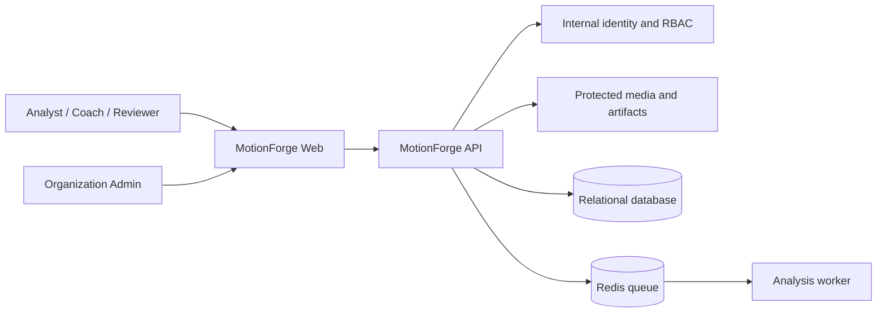
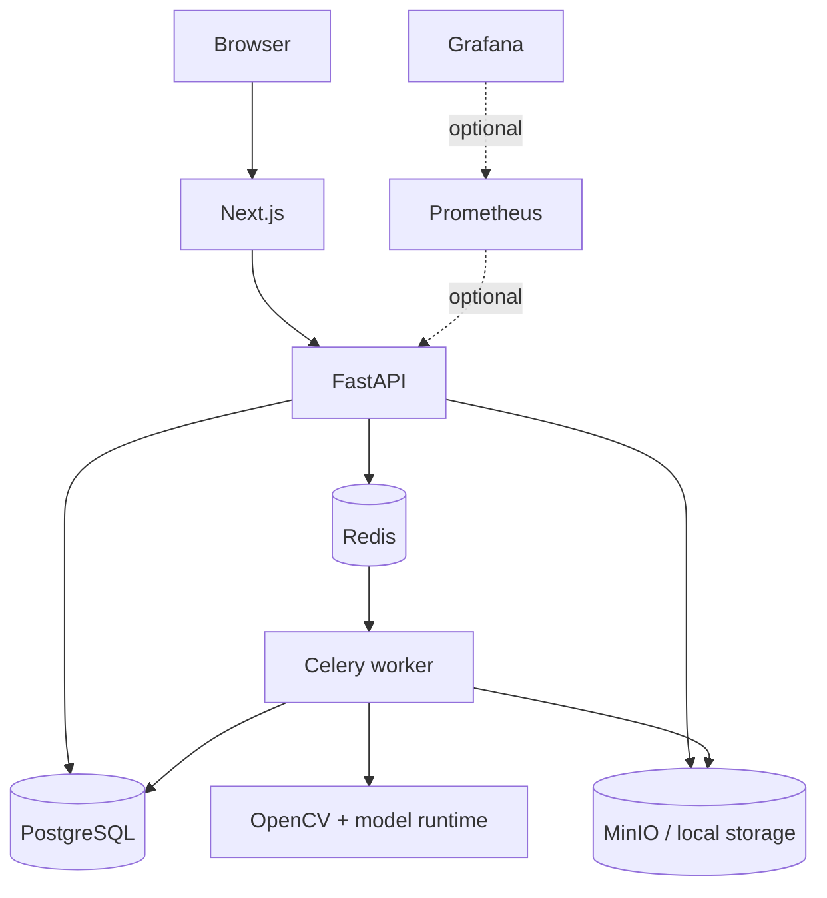
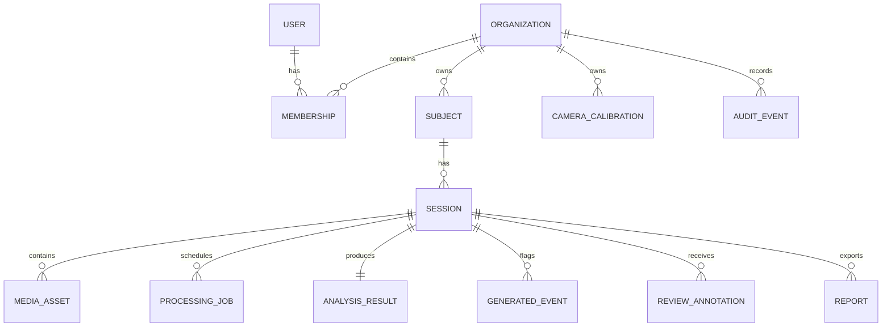
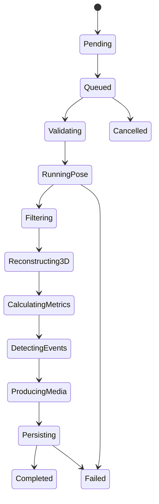
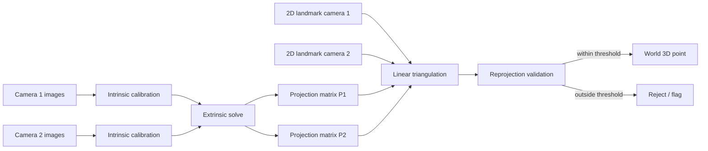
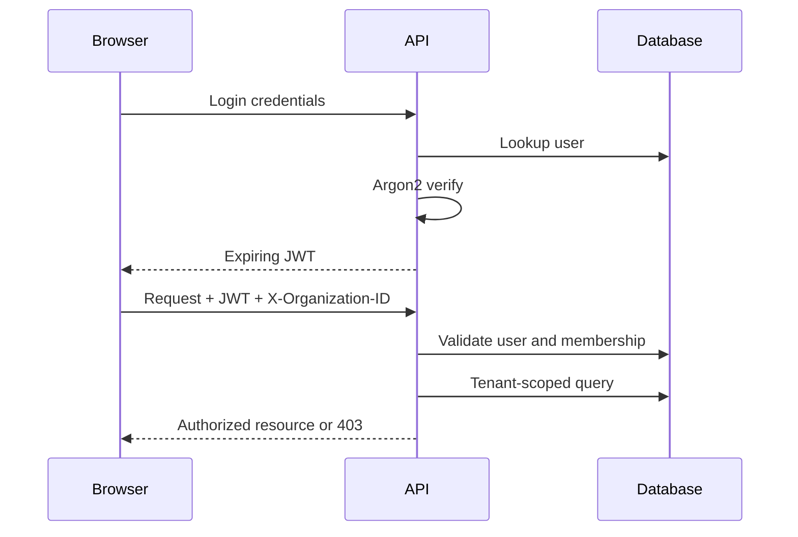
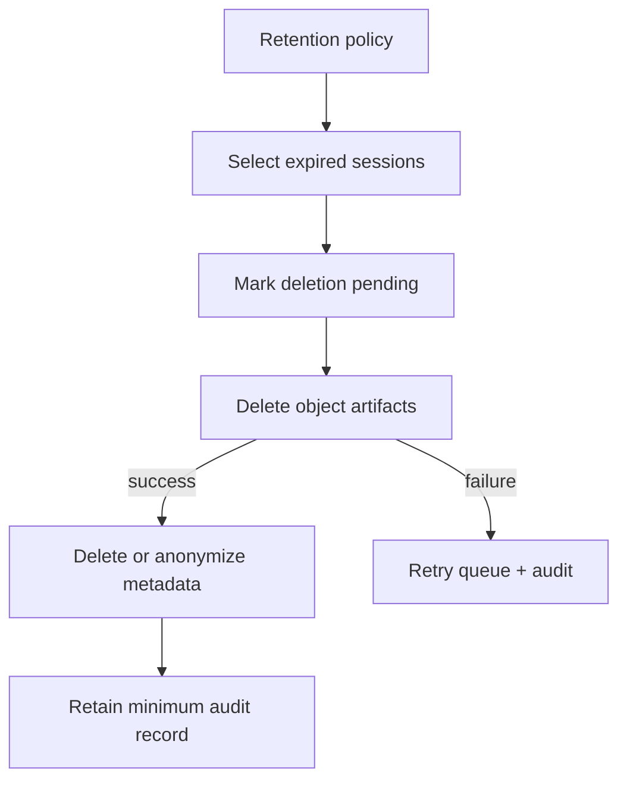
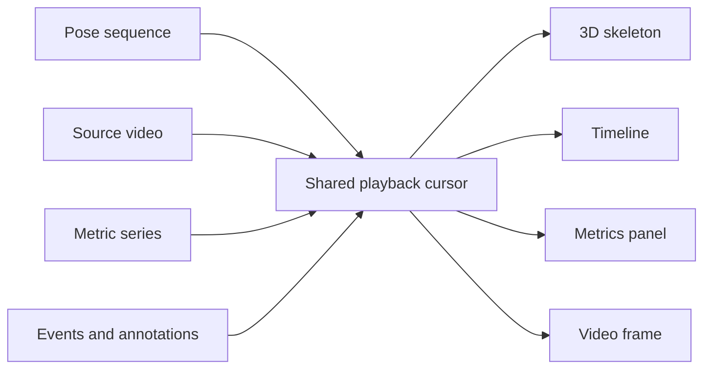
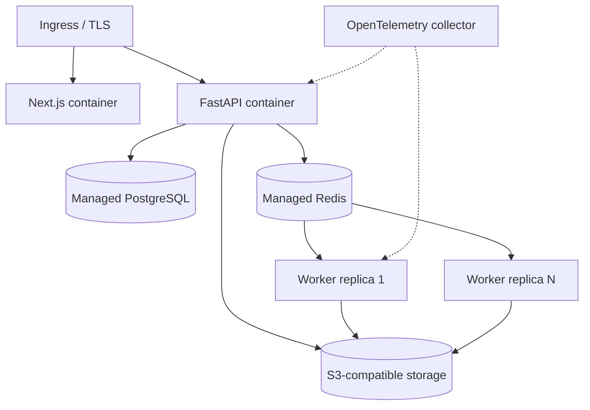

# System Diagrams

## 1. System context

## 2. Container architecture

## 3. Video-processing pipeline

```mermaid
flowchart LR
  U[Validated upload] --> D[Streaming decode]
  D --> S[Frame sampling]
  S --> P[Pose estimation]
  P --> T[Track association]
  T --> Q[Confidence filtering]
  Q --> I[Interpolation]
  I --> O[Outlier handling]
  O --> E[EMA / One Euro]
  E --> A[Angles and derivatives]
  A --> R[Repetitions and phases]
  R --> X[Rules and score]
  X --> V[Evidence + pose artifact + DB summaries]
```

## 4. Database relationship overview

## 5. Processing job state machine

## 6. Multi-camera calibration and triangulation

## 7. Authentication and authorization flow

## 8. Data-retention flow

## 9. Frontend analysis-workspace flow

## 10. Deployment architecture

